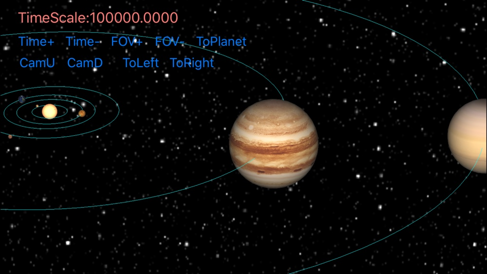

# SolarSystemSimulation
3D Solar System Simulation,the solar system model and the very first prototype come from [threejs-space-simulation](https://github.com/MattLoftus/threejs-space-simulations). This project uses OpenGL ES as its underlying graphics library, and it's implemented first on iOS.

I have finsihed basic rendering of sun and nine planet models,and trajectories of planets are now just some simple circles, and the implementation is unaccurate,I'm working on them.

