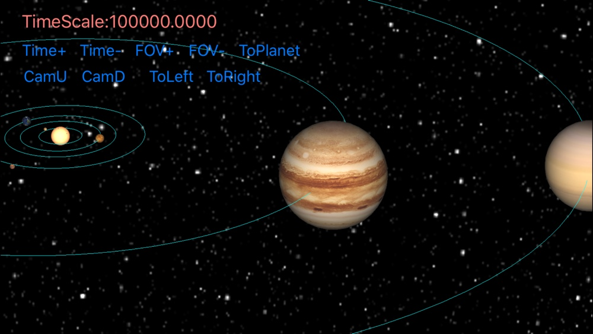
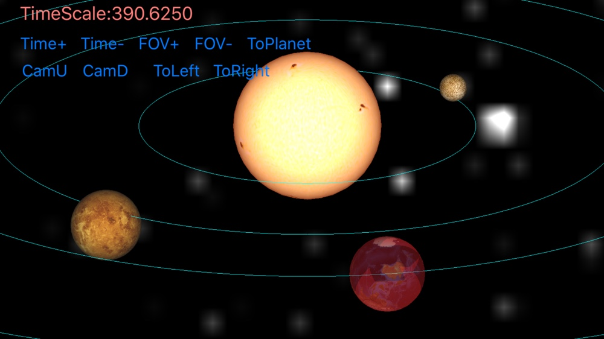

# SolarSystemSimulation
This 3D Solar System Simulation is just an initial project now.the solar system model and the very first prototype come from [threejs-space-simulation](https://github.com/MattLoftus/threejs-space-simulations). This project uses OpenGL ES as its underlying graphics library, and it's implemented first on iOS.

I have finsihed basic rendering of sun and nine planet models,and trajectories of planets are now just some simple circles, and the implementation is unaccurate,I'm working on them.

## Features

 1. basic planet rendering with real planet size scales and textures.
 2. actual revolution and rotation data for motion.
 3. circle (not real ellipse) trajectories rendering.
 4. time scaling and simple camera control (gesture supporting later).
 5. a simple raycast picking implementation (for only ray-sphere intersection, to support more accurate ray-triangle intersection later).
	

